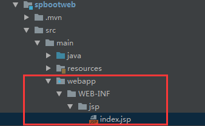
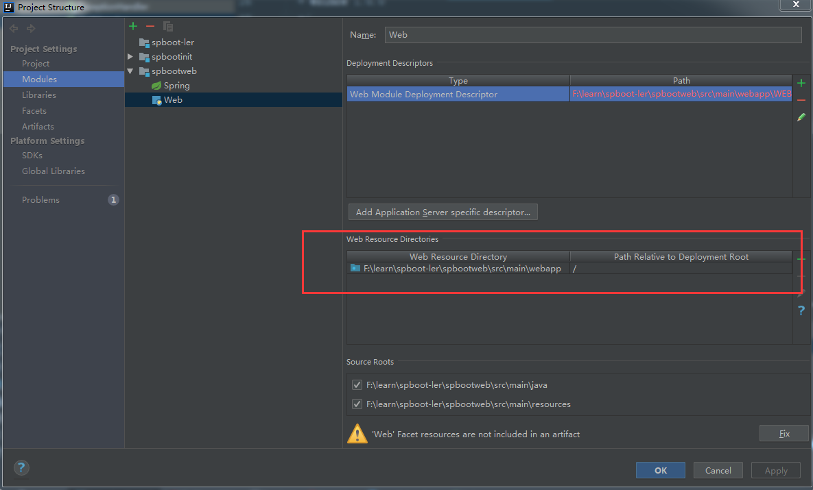
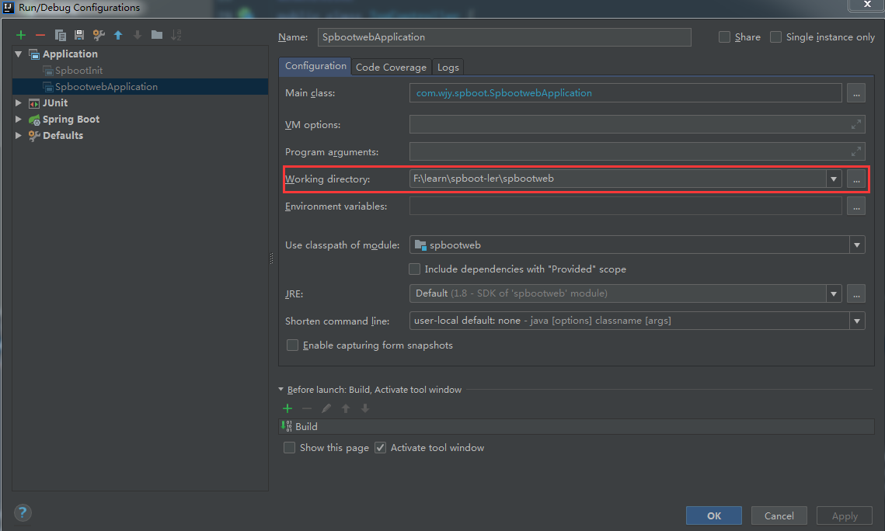

# 整合jsp
1. pom引入相关依赖
```
<dependency>
    <groupId>javax.servlet</groupId>
    <artifactId>jstl</artifactId>
    <scope>compile</scope>
</dependency>
<dependency>
    <groupId>org.apache.taglibs</groupId>
    <artifactId>taglibs-standard-spec</artifactId>
    <version>1.2.5</version>
</dependency>
<dependency>
    <groupId>org.apache.taglibs</groupId>
    <artifactId>taglibs-standard-impl</artifactId>
    <version>1.2.5</version>
</dependency>
<dependency>
    <groupId>org.apache.tomcat.embed</groupId>
    <artifactId>tomcat-embed-jasper</artifactId>
    <version>8.5.35</version>
</dependency>
```
2. src/main下面添加web资源目录,通常是webapp 
3. webapp下面建立jsp的存放目录比如/WEB-INF/jsp,可以在该目录存放jsp文件

4. 配置文件中配置视图相关
```
spring:
  mvc:
    view:
      prefix: /WEB-INF/jsp/
      suffix: .jsp
```
然后就可以使用了
```
@GetMapping("/jsptest")
public String index(Model model) {
    System.out.println("hello********************"+user);
   model.addAttribute("user",user);
    return "index";
}
```
**@GetpMapping注解,及类似的@PostMapping等注解是RequestMapping注解的简化版**
## idea中使用jsp注意
idea中使用jsp模板需要做些配置,不然会报404.

配置web resource directory

如果项目是一个module,则要在运行配置中修改working directory为module的路径
